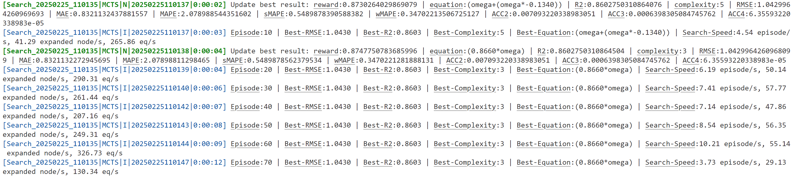

> Official implementation of "*Discover network dynamics with neural symbolic regression*". 

This repository contains the code and data for the experiments in the paper. The code is written in Python and PyTorch.

# System Requirements

The code was tested with Python 3.12.2 and PyTorch 2.4.0+cu121 on Ubuntu 18.04.6 LTS. The code should work on other operating systems as well, but this has not been tested.

The code requires the following Python packages:
```
torch==2.4.0+cu121
numpy==1.26.4
sympy==1.12
pandas==2.2.2
scipy==1.13.0
scikit-learn==1.5.0
matplotlib==3.8.4
networkx==3.3
tqdm==4.66.4
setproctitle==1.3.3
PyYAML==6.0.1
ipython==8.22.2
lxml==5.3.0
geopandas==1.0.1
```
These packages can be installed automatically following the instructions in the [Installation Guide](#installation-guide).

# Installation Guide

To install the required packages, run the following command (Before running the command, you may wanna use a virtual environment by running `python3 -m venv env && source env/bin/activate` or `conda create -p ./env -y python=3.12.2 && conda activate ./env` to avoid conflicts with other packages):
```
pip install -e .
```

We offer a pre-trained neural network model weight, available for download at the [Releases Page](https://github.com/yuzhTHU/ND2/releases/download/checkpoint.pth/checkpoint.pth). Simply save it to `./weights/checkpoint.pth`:
```bash
# (Linux)
wget -O weights/checkpoint.pth https://github.com/yuzhTHU/ND2/releases/download/checkpoint.pth/checkpoint.pth

# (MacOS)
curl -L -o weights/checkpoint.pth https://github.com/yuzhTHU/ND2/releases/download/checkpoint.pth/checkpoint.pth
```

Under normal network conditions, the installation will take approximately **4 minutes**.

# Demo

We provide a demo script to run the pre-trained model on the synthetic dataset. To run the demo, simply execute the following command:
```
python ./search.py
```

This script will load the pre-trained model and search for the symbolic expression that best fits the synthetic dataset `./data/synthetic/KUR.json` (Kuramoto dynamics) as the figure below.


The search will take approximately **1 minutes** on a single NVIDIA RTX 4070 GPU. After the search is complete, the script will output the best symbolic expression found and its error:

As shown in the figure, the discovered formula is 

$`\dot{x} = \omega \times 1.0000 + 1.0000 \times \rho(\sin(\phi_s(x) - \phi_t(x))),`$

which is exactly the Kuramoto dynamics

$`\dot{x}_i = \omega_i + \sum_j A_{ij} \sin (x_i - x_j).`$

by changing $\rho(\cdot) \rightarrow \sum_j A_{ij}(\cdot)$, $\phi_s(\cdot) \rightarrow (\cdot)_i$ and $\phi_t(\cdot) \rightarrow (\cdot)_j$ (we discuss this detailedly in our paper): 


# Insturction for Use

## Q: How to run the code on my own data?

A: You should save your data in a json file including the keys below:
```
{
    // A_ij is the link relationship (1-link, 0-no link) between node i and node j.
    "A": [[A_11, A_12, ..., A_1n], ..., [A_n1, A_n2, ..., A_nn]],

    // G_in_k, G_out_k are the indices (start from 0) of the nodes connected by the k-th edge.
    "G": [[G_in_1, G_out_1], [G_in_2, G_out_2], ..., [G_in_m, G_out_m]],

    // x_tn is the input data (e.g., state) on n-th node at time step t
    "X": [[x_11, x_12, ..., x_1n], ..., [x_t1, x_t2, ..., x_tn]],

    // y_tn is the output data (e.g., state derivative) on n-th node at time step t
    "Y": [[y_11, y_12, ..., y_1n], ..., [y_t1, y_t2, ..., y_tn]],
}
```
where `A` is the adjacency matrix, `G` is the edge lists, `X` is the input data, and `Y` is the output data. 
- If you have multiple input data, save them as `X1`, `X2`, ... (no more than 5). 
- If you have edge-level input data (such as edge weights), save them as `E` (or `E1`, `E2`, ..., no more than 5 as well):
    ```
    {
        ...
        // e_tm is the input data (e.g., weight) on m-th edge at time step t.
        // Note that the order of the edges in "E" should be consistent with that in "G".
        "E": [[e_11, e_12, ..., e_1m], ..., [e_t1, e_t2, ..., e_tm]],
        ...
    }
    ```

Then, following the demo in `search.py` to load & feed your data into the Rewarder, NDformer, as well as MCTS, and simply run `MCTS.fit()` to search for the symbolic expression.


## Q: How to generate simulated data?

A: You can use the `simulate.py` script, which generates a synthetic dataset based on a YAML configuration file. It saves both the generated data and the plotted figure to your specified path.

Specifically, you can run
```bash
python simulate.py --conf ./config/synthetic.yaml --save ./data/synthetic/ --plot ./plot/synthetic/
```
It will traverse each `{key}:{config}` pair in the `./config/synthetic.yaml` configuration file, simulate the node dynamics of the `{key}` system according to the `{config}`, and save the result to `./data/synthetic/{key}.json` and `./plot/synthetic/{key}.png`.

The configuration file specifies the network used for simulation, simulation duration and step size, as well as the initialization and update process of independent and dependent variables in the system. Specifically:
- `network`: Specify the network to use, which can be:
    - `{V: 10, E: 40, direction: False}`: An undirected ER network with `{V}` nodes and `{E}` edges
    - `{use: ./data/networks/NorthernEuropeanGrid.csv}`: Use existing networks
- `N`: Number of steps to simulate
- `dt`: Simulation step size
- `variables`: Specify the independent and dependent variables in system
    - `independent`: The independent variables, which will be initialized before the first simulation step and updated at the end of each step. For example:
        - `x: {type: node, initialize: "np.random.uniform(-5, 5, (1, V))", update: "x + dx * dt"}`: `x` is a node-level variable, which is initialized using a uniform distribution from -5 to 5, and is updated by adding `dx * dt`. Here `V` and `dt` is the number of nodes and the time step, `dx` is a dependent variable needed to be defined below.
        - `omega0: {type: node, initialize: "np.random.uniform(-5, 5, (1, V))"}`: `omega0` is a node-level parameter, which is initialized but never be updated.
        - `w: {type: edge, initialize: "np.random.uniform(-5, 5, (1, E))"}`: `w` is a edge-level parameter (e.g., edge weights), which is initialized but never be updated, where `E` is the number of edges.
    - `dependent`: The dependent variables, which will be calculated in each simulation step based on the values of independent variables. For example:
        - `dx: {type: node, GD_expr: "omega0 + 1.0*aggr(sin(sour(x, G, A)-targ(x, G, A)), G, A)"}` is the time derivative of the Kuramoto dynamics, which is calculated based on the node-level parameters `omega0`, node-level variables `x`, and network structure `G,A`. The `GD_expr` (or `GDExpr`) here means Graph Dynamics Expressions.
- `plot`: Indicates which variables in the system need to be plotted, for example:
    - `[x]`: plot the `t - x(t)` figure
    - `[x, y]`: plot the `x(t) - y(t)` figure
    - `[x, y, z]`: plot the `x(t) - y(t) - z(t)` 3D figure
    - `[sin(x)]`: plot the `t - sin(x(t))` figure, which is useful when you plot the Kuramoto dynamics
