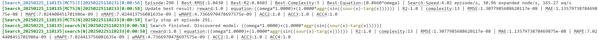

> Official implementation of "*Discover network dynamics with neural symbolic regression*". 

This repository contains the code and data for the experiments in the paper. The code is written in Python and PyTorch.

# System Requirements

The code was tested with Python 3.12.2 and PyTorch 2.4.0+cu121 on Ubuntu 18.04.6 LTS. The code should work on other operating systems as well, but this has not been tested.

The code requires the following Python packages:
```
torch==2.4.0+cu121
numpy==1.26.4
sympy==1.12
pandas==2.2.2
scipy==1.13.0
scikit-learn==1.5.0
matplotlib==3.8.4
networkx==3.3
tqdm==4.66.4
setproctitle==1.3.3
PyYAML==6.0.1
ipython==8.22.2
lxml==5.3.0
geopandas==1.0.1
```
These packages can be installed automatically following the instructions in the [Installation Guide](#installation-guide).

# Installation Guide

To install the required packages, run the following command (Before running the command, you may wanna use a virtual environment by running `python3 -m venv env` and then `source env/bin/activate` to avoid conflicts with other packages):
```
pip install -e .
```

We offer a pre-trained neural network model weight, available for download at the [Releases Page](https://github.com/yuzhTHU/ND2/releases/download/checkpoint.pth/checkpoint.pth). Simply save it to `./weights/checkpoint.pth`:
```bash
# (Linux)
wget -O weights/checkpoint.pth https://github.com/yuzhTHU/ND2/releases/download/checkpoint.pth/checkpoint.pth

# (MacOS)
curl -L -o weights/checkpoint.pth https://github.com/yuzhTHU/ND2/releases/download/checkpoint.pth/checkpoint.pth
```

Under normal network conditions, the installation will take approximately **4 minutes**.

# Demo

We provide a demo script to run the pre-trained model on the synthetic dataset. To run the demo, simply execute the following command:
```
python ./search.py
```

This script will load the pre-trained model and search for the symbolic expression that best fits the synthetic dataset `./data/synthetic/KUR.json` (Kuramoto dynamics) as the figure below.


The search will take approximately **1 minutes** on a single NVIDIA RTX 4070 GPU. After the search is complete, the script will output the best symbolic expression found and its error:

As shown in the figure, the discovered formula is
$$
\dot{\bm x} = \bm\omega \times 1.0000 + 1.0000 \times \rho(\sin(\bm\phi_s(x) - \bm\phi_t(x))),
$$
which is exactly the Kuramoto dynamics by changing $\rho(\cdot) \rightarrow \sum_j A_{ij}(\cdot)$, $\phi_s(\cdot) \rightarrow (\cdot)_i$ and $\phi_t(\cdot) \rightarrow (\cdot)_j$ (we discuss this detailedly in our paper):
$$
\dot{x}_i = \omega_i + \sum_{j} A_{ij} \sin (x_i - x_j).
$$


# Insturction for Use

**Q: How to run the code on my own data?**

A: You should save your data in a json file including the keys below:
```json
{
    "A" [[A_11, A_12, ..., A_1n], ..., [A_n1, A_n2, ..., A_nn]],  // A_ij is the link relationship (1-link, 0-no link) between node i and node j.
    "G" [[G_in_1, G_out_1], [G_in_2, G_out_2], ..., [G_in_m, G_out_m]],   // G_in_k, G_out_k are the indices (start from 0) of the nodes connected by the k-th edge.
    "X": [[x_11, x_12, ..., x_1n], ..., [x_t1, x_t2, ..., x_tn]],
    "Y": [[y_11, y_12, ..., y_1n], ..., [y_t1, y_t2, ..., y_tn]],
}
```
where `A` is the adjacency matrix, `G` is the edge lists, `X` is the input data, and `Y` is the output data. 
- If you have multiple input data, save them as `X1`, `X2`, ... (no more than 5). 
- If you have edge-level input data (such as edge weights), save them as `E` (or `E1`, `E2`, ..., no more than 5 as well):
    ```json
    {
        ...
        "E": [[e_11, e_12, ..., e_1m], ..., [e_t1, e_t2, ..., e_tm]],
        // Note that the order of the edges in `E` should be consistent with that in `G`.
        ...
    }
    ```

Then, following the demo in `search.py` to load & feed your data into the Rewarder, NDformer, as well as MCTS, and simply run `MCTS.fit()` to search for the symbolic expression.
